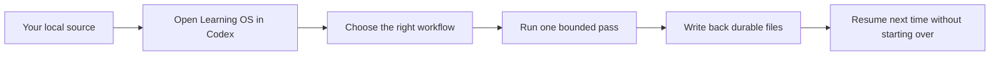
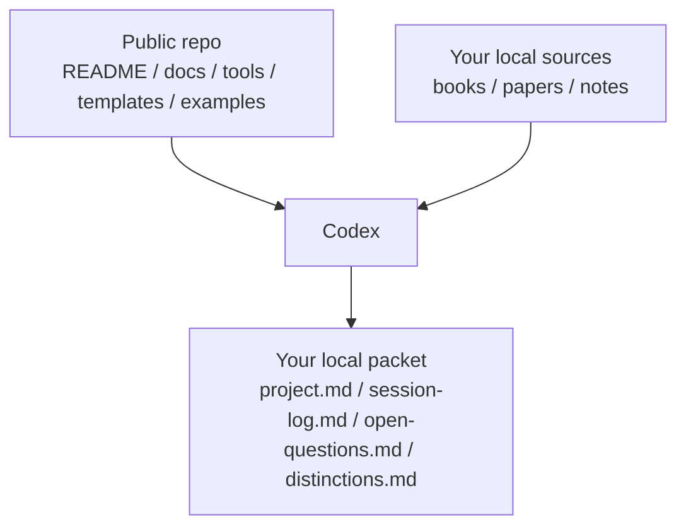

<div align="right">
  <a href="./README.md">English</a> | <a href="./README.zh-CN.md">简体中文</a>
</div>

# Learning OS

`Type: AI Harness` `Mode: Local-First` `Sources: BYOS` `License: MIT`

Learning OS is a local-first study workspace you open in Codex. You bring your own sources, Codex routes the work, and the repo helps you keep durable study files instead of losing everything in chat.

Prefer a packaged snapshot over `git clone`? See [Releases](https://github.com/adsrz/learning-os/releases).

## Start Here

1. Download the repo snapshot (`source.zip`) from Releases or GitHub.
2. Unzip it.
3. Open the folder as a project in Codex.
4. If you want the shortest first success path, open [docs/demo-flow.md](docs/demo-flow.md).
5. If you want to use your own materials later, follow [docs/public-setup.md](docs/public-setup.md) and [docs/bring-your-own-sources.md](docs/bring-your-own-sources.md).

You can understand the repo and try the included demo immediately. You do not need to set up a private library before the public surface makes sense.

## What This Repo Does

- turns one local source into reusable study state
- keeps the next step, open questions, and distinctions in files instead of only in chat
- supports deep reading, synthesis, thesis-style reading, and research intake
- stays `local-first` and `BYOS`, so the public repo can remain clean and reusable

## What You Get

When a pass goes well, the useful output is not only the answer in chat. You also keep a small packet that survives the session:

- `project.md`
- `session-log.md`
- `open-questions.md`
- `distinctions.md`

## How It Works

### One source in, one useful packet out



### What lives where



## Try It In 5 Minutes

If you want to see whether the repo is real before reading deeper architecture, do this:

```text
input   -> samples/open/demo-source.md
guide   -> docs/demo-flow.md
output  -> examples/research-intake-packet/{project.md,session-log.md,open-questions.md,distinctions.md}
```

1. Open [docs/demo-flow.md](docs/demo-flow.md).
2. Compare [samples/open/demo-source.md](samples/open/demo-source.md) with [examples/research-intake-packet](examples/research-intake-packet).
3. If you want to verify the public surface, run:

```powershell
pwsh -NoProfile -File ./tools/Test-All.ps1 -RepoOnly
```

On Windows, the convenience wrapper still works:

```powershell
.\tools\Test-All.cmd -RepoOnly
```

Expected result:

```text
project.md        -> workflow_mode: research / paper workflow
session-log.md    -> what changed and what to do next
open-questions.md -> what still needs evidence or clarification
distinctions.md   -> important differences worth keeping
```

That is the core public proof surface of the repo: one open sample goes in, and a reusable packet comes out.

## What Makes It Different

| Surface | Prompt-only chat | Learning OS |
| --- | --- | --- |
| Output | one answer in chat history | durable packet files |
| Continuity | manual recap next session | packet state survives the pass |
| Routing | one generic conversation | explicit workflow choice |
| Validation | little visible proof | repo-safe checks and boundary-sensitive validation |
| Sources | context pasted ad hoc | explicit local source boundary |

## What It Supports

- `Single-book deep reading`
  One primary source, slow mechanism-first reading, cumulative write-back.
- `Multi-book synthesis`
  Several sources routed into one structured program without flattening them into one book.
- `Thesis / non-textbook reading`
  Argument-heavy reading that needs a different protocol from textbook-style study.
- `Research / paper workflow`
  Papers, reports, and captured articles that need intake and classification before deeper study.

## Next Reads

- `Run it with Codex`
  Start with [docs/run-with-codex.md](docs/run-with-codex.md).
- `AI entry`
  Start with [AI_CONTEXT.md](AI_CONTEXT.md), then [ai-context.json](ai-context.json), [task-router.json](task-router.json), and [writeback-map.json](writeback-map.json).
- `Architecture`
  Read [docs/architecture.md](docs/architecture.md), [docs/ai-harness.md](docs/ai-harness.md), and [docs/agent-architecture.md](docs/agent-architecture.md).
- `Contribute`
  Use [ROADMAP.md](ROADMAP.md), [CONTRIBUTING.md](CONTRIBUTING.md), and [Issues](https://github.com/adsrz/learning-os/issues).

## Portable CLI Path

```powershell
pwsh -NoProfile -File ./tools/Test-All.ps1 -RepoOnly
$SOURCE_ROOT = "/absolute/path/to/your/files" # or C:\path\to\your\files on Windows
pwsh -NoProfile -File ./tools/Import-LocalSources.ps1 -SourceRoot $SOURCE_ROOT
pwsh -NoProfile -File ./tools/Test-PublicSetup.ps1
```

Windows `.cmd` wrappers are included, but the documented primary path uses `pwsh` so the repo does not read as Windows-only.

## Repo Map

- [system.md](system.md)
  Public identity and operating principles.
- [AI_CONTEXT.md](AI_CONTEXT.md)
  The shortest AI-facing entrypoint.
- [docs/demo-flow.md](docs/demo-flow.md)
  The shortest public walkthrough.
- [docs/run-with-codex.md](docs/run-with-codex.md)
  How to operate the repo as a Codex-driven harness.
- [docs/architecture.md](docs/architecture.md)
  The simple public architecture view.
- [agent/README.md](agent/README.md)
  Minimal public-safe agent layer.
- [templates/project-template](templates/project-template)
  Minimal reusable project skeleton for durable write-back.
- [examples](examples)
  Worked public-safe packets you can compare against.
- [tools](tools)
  Validation and local-source import helpers.

## Public Boundary

This public repository does **not** include third-party books, papers, PDFs, slides, or proprietary study materials.

You are expected to bring your own lawfully obtained sources.

That boundary is deliberate:

- it keeps the repo safer to publish and easier to share
- it keeps the harness reusable beyond one private library
- it lets the same operating model work across finance, economics, philosophy, policy, ML, and other reading-heavy domains

## License

This repository is licensed under the MIT License. See [LICENSE](LICENSE).

Third-party books, papers, PDFs, slides, and other source materials are not included and are not covered by this repository license.
