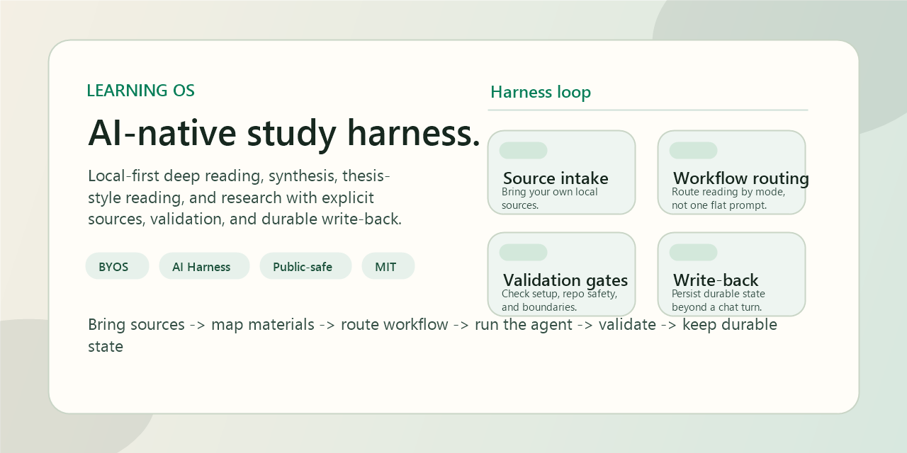

<div align="right">
  <a href="./README.md">English</a> | <a href="./README.zh-CN.md">简体中文</a>
</div>

# Learning OS

[](./LICENSE)


An AI-native, local-first learning harness for deep reading, synthesis, thesis-style reading, and research workflows.

`Learning OS` is not just a study repo. It is a harness: it gives an AI agent explicit source boundaries, workflow routing, validation gates, and durable write-back so long-horizon learning can stay structured instead of collapsing into generic chat.



## Why This Is An AI Harness

Most AI study setups are just prompts pointed at a pile of notes.

`Learning OS` adds the missing harness layer:

- `Source intake`
  The system expects explicit source manifests and local source roots instead of implicit context blobs.
- `Workflow routing`
  Reading modes are routed differently for single-book work, synthesis, thesis-style reading, and research intake.
- `Validation gates`
  Repo-safe checks and public/private boundaries are part of the operating model, not an afterthought.
- `Durable write-back`
  The useful output is not only the chat response. It is the updated project state, distinctions, open questions, and reusable notes.
- `Local-first operation`
  The system is designed to run against your own files and your own lawfully obtained sources.

## What It Supports

The harness currently ships with four reusable workflow modes:

- `Single-book deep reading`
  One primary source, slow mechanism-first reading, cumulative write-back.
- `Multi-book synthesis`
  Several sources routed into one structured program without flattening them into one book.
- `Thesis / non-textbook reading`
  Argument-heavy or theory-first books that need a different reading protocol from textbook-style study.
- `Research / paper workflow`
  Papers, reports, captured articles, and intake pipelines that need classification before study.

These are reference workflows, not a fixed canon. The harness is source-agnostic.

## Harness Loop

```text
Bring your own sources -> classify and map local materials -> route by workflow mode -> run the agentic study pass -> validate -> write back durable state
```

## Start Here

Run the public repo checks:

```powershell
.\tools\Test-All.cmd -RepoOnly
```

Then read the core docs:

- [docs/ai-harness.md](docs/ai-harness.md)
- [docs/agent-architecture.md](docs/agent-architecture.md)
- [docs/public-setup.md](docs/public-setup.md)
- [docs/bring-your-own-sources.md](docs/bring-your-own-sources.md)
- [docs/workflow-modes.md](docs/workflow-modes.md)

Try the included open sample:

- [samples/open/demo-source.md](samples/open/demo-source.md)

When you want to use your own materials:

```powershell
.\tools\Import-LocalSources.cmd -SourceRoot C:\path\to\your\files
.\tools\Test-PublicSetup.cmd
```

## Repo Map

- [system.md](system.md)
  Public identity and operating principles.
- [system_detail.md](system_detail.md)
  Public/private boundary rules and file responsibilities.
- [docs/ai-harness.md](docs/ai-harness.md)
  What makes this project a harness rather than a generic study repo.
- [docs/agent-architecture.md](docs/agent-architecture.md)
  The harness loop and public-facing agent architecture.
- [docs/architecture.md](docs/architecture.md)
  How the repo is split into harness, examples, and local-source layers.
- [docs/workflow-modes.md](docs/workflow-modes.md)
  The four supported learning modes.
- [docs/examples](docs/examples)
  Example mode write-ups you can adapt.
- [docs/source-manifest.template.json](docs/source-manifest.template.json)
  Template for mapping your own sources into the local layout.
- [tools](tools)
  Validation and local-source import helpers.

## Public Boundary

This public repository does **not** include third-party books, papers, PDFs, slides, or proprietary study materials.

You are expected to bring your own lawfully obtained sources.

That boundary is deliberate:

- it keeps the repo safer to publish and easier to share
- it keeps the harness reusable beyond one private library
- it lets the same operating model work across finance, economics, philosophy, policy, ML, and other reading-heavy domains

## License

This repository is licensed under the MIT License. See [LICENSE](LICENSE).

Third-party books, papers, PDFs, slides, and other source materials are not included and are not covered by this repository license.
