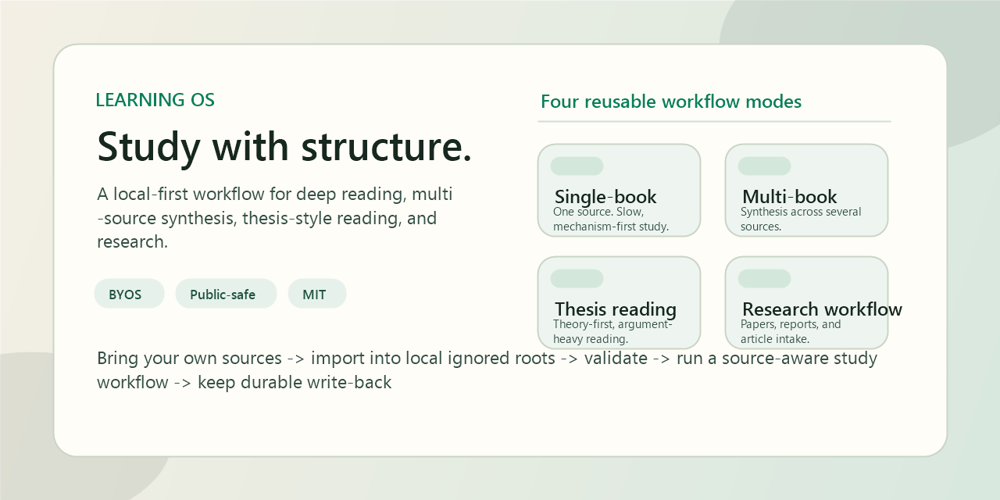

<div align="right">
  <a href="./README.md">English</a> | <a href="./README.zh-CN.md">简体中文</a>
</div>

# Learning OS

[](./LICENSE)


A local-first learning operating system for deep reading, synthesis, thesis-style reading, and research workflows.

`Learning OS` is not a note dump and not a personal vault template. It is a reusable study protocol for people who want continuity, structure, explicit source handling, and validation-backed repo hygiene.



## Why This Exists

Most study repos can store notes. Very few can run a serious learning process.

`Learning OS` is designed to make these things first-class:

- long-horizon continuity across real study arcs
- source-aware workflows instead of generic note capture
- reusable distinctions, evidence, and open questions
- public-safe sharing without bundling copyrighted materials
- bring-your-own-sources operation across different domains

## Workflow Modes

The framework currently ships with four reusable workflow modes:

- `Single-book deep reading`
  One primary source, slow mechanism-first reading, cumulative write-back.
- `Multi-book synthesis`
  Several sources routed into one structured program without flattening them into one book.
- `Thesis / non-textbook reading`
  Books that are argument-heavy, essay-like, or theory-first rather than textbook-first.
- `Research / paper workflow`
  Papers, reports, captured articles, and intake pipelines that need classification before study.

These are reference workflows, not a fixed canon. The system is source-agnostic.

## What Makes It Different

- `Public-safe by design`
  The repo can be shared without redistributing third-party books or papers.
- `BYOS`
  Bring your own lawfully obtained sources and map them into the local ignored source roots.
- `Protocol-first`
  The repo is built around repeatable learning workflows, not around one subject or one reading list.
- `Example-backed`
  The included examples show how the workflow modes can be applied to serious study programs.

## At A Glance

```text
Bring your own sources -> map them into local ignored roots -> validate setup -> run a source-aware study workflow -> keep durable write-back
```

## Quick Start

Run the public repo checks:

```powershell
.\tools\Test-All.cmd -RepoOnly
```

Read the setup and workflow docs:

- [docs/public-setup.md](docs/public-setup.md)
- [docs/bring-your-own-sources.md](docs/bring-your-own-sources.md)
- [docs/workflow-modes.md](docs/workflow-modes.md)

Try the included open sample:

- [samples/open/demo-source.md](samples/open/demo-source.md)

When you want to use your own materials:

```powershell
.\tools\Import-LocalSources.cmd -SourceRoot C:\path\to\your\files
.\tools\Test-PublicSetup.cmd
```

## Repo Map

- [system.md](system.md)
  Public identity and operating principles.
- [system_detail.md](system_detail.md)
  Public/private boundary rules and file responsibilities.
- [docs/architecture.md](docs/architecture.md)
  How the repo is split into core, examples, and local source layers.
- [docs/workflow-modes.md](docs/workflow-modes.md)
  The four supported learning modes.
- [docs/examples](docs/examples)
  Example mode write-ups you can adapt.
- [docs/source-manifest.template.json](docs/source-manifest.template.json)
  Template for mapping your own sources into the local layout.
- [tools](tools)
  Validation and local-source import helpers.

## Examples, Not Limits

The private workspace that inspired this repo includes examples such as:

- derivatives as `single-book deep reading`
- fixed income as `multi-book synthesis`
- thesis-style reading as `non-textbook reading`
- paper and report intake as `research workflow`

In the public repo, those examples are treated as workflow references, not as a required library.

## Public Boundary

This public repository does **not** include third-party books, papers, PDFs, slides, or proprietary study materials.

You are expected to bring your own lawfully obtained sources.

That boundary is deliberate:

- it keeps the repo safer to publish and easier to share
- it keeps the framework reusable beyond one private library
- it lets the same operating model work across finance, economics, philosophy, policy, ML, and other reading-heavy domains

## Validation

Repo-only validation:

```powershell
.\tools\Test-All.cmd -RepoOnly
```

Local setup validation after importing your own sources:

```powershell
.\tools\Test-All.cmd
```

## License

This repository is licensed under the MIT License. See [LICENSE](LICENSE).

Third-party books, papers, PDFs, slides, and other source materials are not included and are not covered by this repository license.
