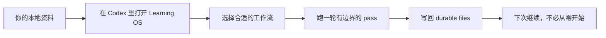
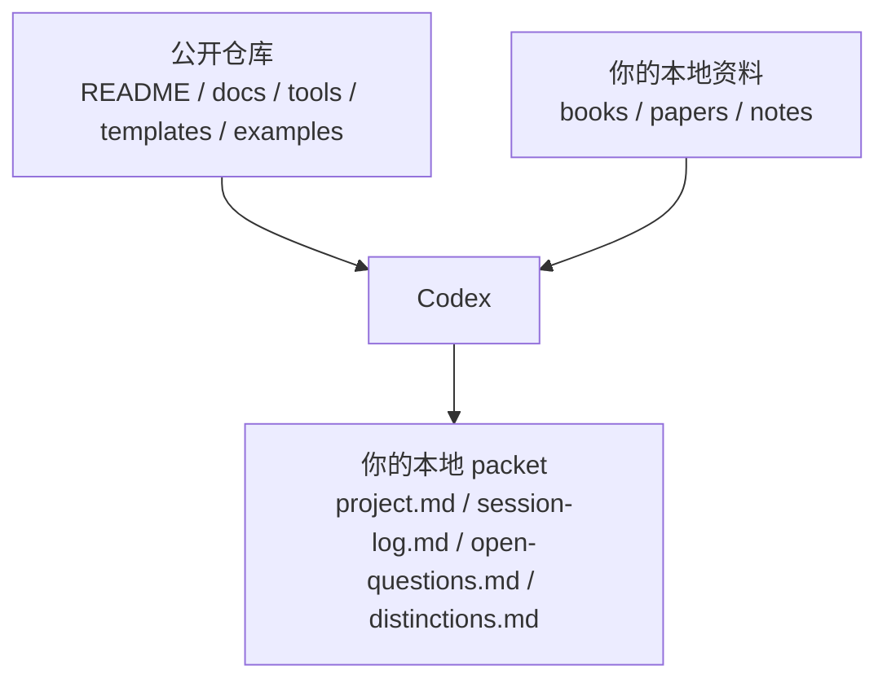

<div align="right">
  <a href="./README.md">English</a> | <a href="./README.zh-CN.md">简体中文</a>
</div>

# Learning OS

`Type: AI Harness` `Mode: Local-First` `Sources: BYOS` `License: MIT`

`Learning OS` 是一个直接用 Codex 打开的、本地优先的学习工作区。你自带资料，Codex 负责按合适的工作流处理任务，而这个仓库负责把学习结果沉淀成可持续写回的文件，而不是只留在聊天记录里。

如果你更想下载一个打包快照，而不是先 `git clone`，可以看 [Releases](https://github.com/adsrz/learning-os/releases)。

## 先这样用

1. 从 Releases 或 GitHub 下载仓库快照 `source.zip`。
2. 解压。
3. 用 Codex 把这个文件夹作为项目打开。
4. 如果你只想先看最短的上手路径，打开 [docs/demo-flow.md](docs/demo-flow.md)。
5. 如果之后想接入你自己的资料，再看 [docs/public-setup.md](docs/public-setup.md) 和 [docs/bring-your-own-sources.md](docs/bring-your-own-sources.md)。

你可以立刻看懂仓库，也可以直接试内置 demo。还不需要先准备一整套私有资料库。

## 这个仓库是干什么的

- 把一份本地资料变成可持续复用的学习状态
- 把下一步、未解决问题和关键区分写进文件，而不是只留在聊天里
- 支持深度阅读、多书综合、论述型阅读和研究资料 intake
- 保持 `local-first` 和 `BYOS`，所以公开仓库可以一直保持干净、可复用

## 你最后会得到什么

一次 pass 做得好的时候，真正留下来的不只是聊天回答，还会有一个能延续下去的小 packet：

- `project.md`
- `session-log.md`
- `open-questions.md`
- `distinctions.md`

## 它怎么工作

### 一份资料进去，一个有用的 packet 出来



### 东西分别放在哪里



## 5 分钟看懂它是不是真的有用

如果你想先确认这个仓库是不是实的，而不是先读更深的架构，先走这一条：

```text
input   -> samples/open/demo-source.md
guide   -> docs/demo-flow.md
output  -> examples/research-intake-packet/{project.md,session-log.md,open-questions.md,distinctions.md}
```

1. 打开 [docs/demo-flow.md](docs/demo-flow.md)。
2. 对照 [samples/open/demo-source.md](samples/open/demo-source.md) 和 [examples/research-intake-packet](examples/research-intake-packet)。
3. 如果你想验证公开 surface，再运行：

```powershell
pwsh -NoProfile -File ./tools/Test-All.ps1 -RepoOnly
```

在 Windows 上，也可以继续用便捷 wrapper：

```powershell
.\tools\Test-All.cmd -RepoOnly
```

预期结果大致是这样：

```text
project.md        -> 当前在学什么、资料边界是什么
session-log.md    -> 这次发生了什么、下一步该做什么
open-questions.md -> 还有哪些问题没有解决
distinctions.md   -> 哪些重要区分值得保留下来
```

这就是仓库最核心的公开 proof：一个开放 sample 进入系统，出来的是一个可复用的 packet。

## 它和普通 prompt 聊天有什么不同

| 维度 | Prompt-only chat | Learning OS |
| --- | --- | --- |
| 输出 | 留下一次性的回答 | 留下 durable packet files |
| 连续性 | 下次要手动重建上下文 | packet state 会保留下来 |
| 路由 | 一次泛化对话 | 明确选择工作流 |
| 验证 | 几乎没有显式 proof | 有 repo-safe checks 和边界验证 |
| 资料边界 | 靠聊天临时拼接 | 明确依赖本地 source boundary |

## 它支持哪些工作

- `Single-book deep reading`
  一份主资料，慢速、机制优先、持续写回。
- `Multi-book synthesis`
  多份资料进入同一个学习项目，但不会被粗暴压扁成一本书。
- `Thesis / non-textbook reading`
  适合论述性强、理论先行的阅读对象。
- `Research / paper workflow`
  适合论文、报告、抓取文章这类要先 intake 和分类的材料。

## 下一步看什么

- `想直接在 Codex 里跑`
  先看 [docs/run-with-codex.md](docs/run-with-codex.md)。
- `想给 AI 一个最短入口`
  先看 [AI_CONTEXT.md](AI_CONTEXT.md)，再看 [ai-context.json](ai-context.json)、[task-router.json](task-router.json) 和 [writeback-map.json](writeback-map.json)。
- `想看更完整的架构`
  看 [docs/architecture.md](docs/architecture.md)、[docs/ai-harness.md](docs/ai-harness.md) 和 [docs/agent-architecture.md](docs/agent-architecture.md)。
- `想参与扩展`
  看 [ROADMAP.md](ROADMAP.md)、[CONTRIBUTING.md](CONTRIBUTING.md) 和 [Issues](https://github.com/adsrz/learning-os/issues)。

## 可移植命令路径

```powershell
pwsh -NoProfile -File ./tools/Test-All.ps1 -RepoOnly
$SOURCE_ROOT = "/absolute/path/to/your/files" # Windows 上也可以改成 C:\path\to\your\files
pwsh -NoProfile -File ./tools/Import-LocalSources.ps1 -SourceRoot $SOURCE_ROOT
pwsh -NoProfile -File ./tools/Test-PublicSetup.ps1
```

仓库仍然提供 Windows `.cmd` wrapper，但对外主路径仍然是 `pwsh`，这样不会把项目读成一个只能在 Windows 上跑的仓库。

## 仓库结构

- [system.md](system.md)
  项目的公开身份与运行原则。
- [AI_CONTEXT.md](AI_CONTEXT.md)
  给 AI 的最短入口。
- [docs/demo-flow.md](docs/demo-flow.md)
  最短的公开演示路径。
- [docs/run-with-codex.md](docs/run-with-codex.md)
  说明如何把这个仓库作为 Codex 项目来运行。
- [docs/architecture.md](docs/architecture.md)
  更简单的公开架构视图。
- [agent/README.md](agent/README.md)
  最小公开 agent layer。
- [templates/project-template](templates/project-template)
  用于 durable write-back 的最小项目骨架。
- [examples](examples)
  可以直接对照的公开示例 packet。
- [tools](tools)
  校验和本地资料导入工具。

## Public Boundary

这个公开仓库 **不包含** 第三方书籍、论文、PDF、幻灯片或其他专有学习材料。

你需要自带自己合法获得的资料。

这样设计是有意的：

- 让仓库更安全地公开发布和分享
- 让这套 harness 不会被某一套私有资料绑死
- 让同一套运行方式能用于金融、经济、哲学、政策、机器学习等重阅读领域

## 许可证

本仓库采用 [MIT License](LICENSE)。

第三方书籍、论文、PDF、幻灯片和其他 source materials 不包含在仓库中，也不受本仓库许可覆盖。
