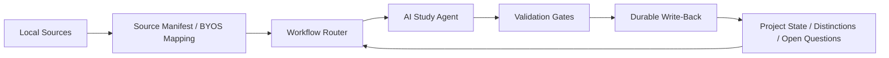

# Agent Architecture

This public repo exposes the harness as a local-first, source-aware loop.

## Harness Loop

## Component Roles

- `Local Sources`
  User-owned books, papers, reports, or captured long-form material.
- `Source Manifest / BYOS Mapping`
  The explicit mapping between source ids, expected files, and local ignored paths.
- `Workflow Router`
  Decides whether the work belongs to single-book reading, synthesis, thesis-style reading, or research intake.
- `AI Study Agent`
  Executes the actual reading or reasoning pass inside those boundaries.
- `Validation Gates`
  Check repo-safe assumptions, setup integrity, and public/private boundary expectations.
- `Durable Write-Back`
  Stores the useful output in files that survive beyond chat.
- `Project State`
  The cumulative learning state that future work can resume from.

## Public Surface vs Private Surface

The public repo includes:

- harness docs
- validators
- import helpers
- examples
- open demo inputs

The public repo excludes:

- private source libraries
- personal runtime state
- personal machine paths
- proprietary source bundles

That split is what keeps the harness reusable while still allowing deep local use.
