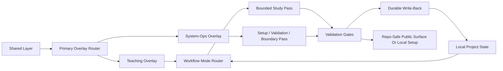

# Agent Architecture

This public repo exposes the harness as a local-first, overlay-aware, source-aware loop.

## Harness Loop

## Component Roles

- `Shared Layer`
  The low-token contract that tells the agent what this repo is, what it is not, and which boundaries must survive every task.
- `Primary Overlay Router`
  Decides whether the task belongs to `teaching` or `system-ops`.
- `Teaching Overlay`
  Owns source-aware learning work that should route into a workflow mode.
- `System-Ops Overlay`
  Owns setup, validation, boundary checks, and repo-safe harness maintenance.
- `Workflow Mode Router`
  Decides whether the study work belongs to single-book reading, synthesis, thesis-style reading, or research intake.
- `Bounded Study Pass`
  Executes the actual reading or reasoning pass inside those boundaries.
- `Setup / Validation / Boundary Pass`
  Executes a bounded `system-ops` task without pretending it is a teaching packet.
- `Validation Gates`
  Check repo-safe assumptions, setup integrity, and public/private boundary expectations for both overlays.
- `Durable Write-Back`
  Stores the useful `teaching` output in files that survive beyond chat.
- `Local Project State`
  The cumulative learning state that future work can resume from.
- `Repo-Safe Public Surface Or Local Setup`
  The maintained public docs/tools surface or the validated local setup result from a `system-ops` task.

## Public Surface vs Private Surface

The public repo includes:

- harness docs
- minimal public-safe agent skills
- project templates for write-back
- worked example packets
- validators
- import helpers
- examples
- open demo inputs

The public repo excludes:

- private source libraries
- personal runtime state
- personal machine paths
- proprietary source bundles

That split is what keeps the harness reusable while still allowing deep local use.
