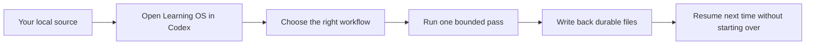
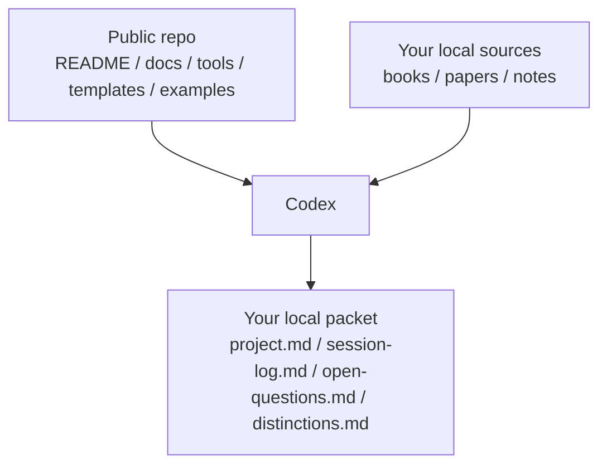

# Architecture

If you only need the simple version, start with these two diagrams.

## One source in, one useful packet out

## What lives where

## Public Repo Shape

`Learning OS` is easiest to understand as four public pieces plus one local layer:

1. `shared entry`
   - `README.md`
   - `AI_CONTEXT.md`
   - `ai-context.json`
2. `workflow and setup docs`
   - `docs/run-with-codex.md`
   - `docs/demo-flow.md`
   - `docs/ai-harness.md`
3. `tools and templates`
   - validators
   - import helpers
   - `templates/README.md`
   - `templates/project-template`
   - `templates/multi-book-project-template`
4. `worked examples`
   - public-safe packets under `examples/`
5. `your local BYOS layer`
   - your own books, papers, notes, and project folders
   - intentionally kept out of tracked Git history

## Deeper Routing Model

If you want the more technical view, the repo still follows the same layered idea:

1. `shared layer`
   - AI entrypoints
   - repo identity
   - public routing rules
   - machine-readable shared contract
2. `primary overlay layer`
   - `teaching`
   - `system-ops`
   - task classification before deeper execution
3. `operator and validation layer`
   - setup docs
   - validators
   - import helpers
   - public/private boundary enforcement
4. `reference workflow layer`
   - example write-ups for the four workflow modes
   - open demo material
   - project templates for durable write-back
   - worked example packets
5. `local BYOS layer`
   - user-owned books, papers, and research materials
   - intentionally ignored by Git

## Design Goal

The repo should still be understandable on a clean clone, but more powerful once you add your own source materials and run the harness against them.

## Non-Goal

This repository is not a public redistribution channel for copyrighted books or papers.
